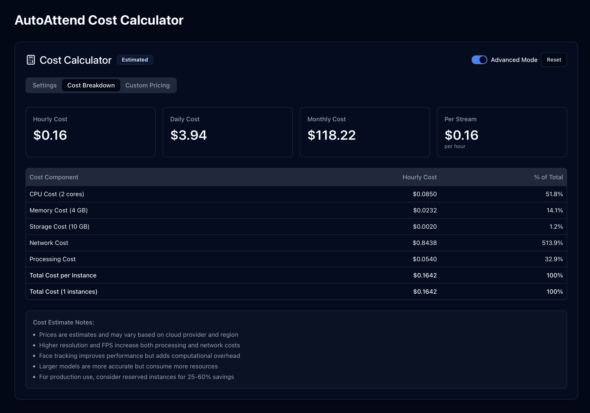
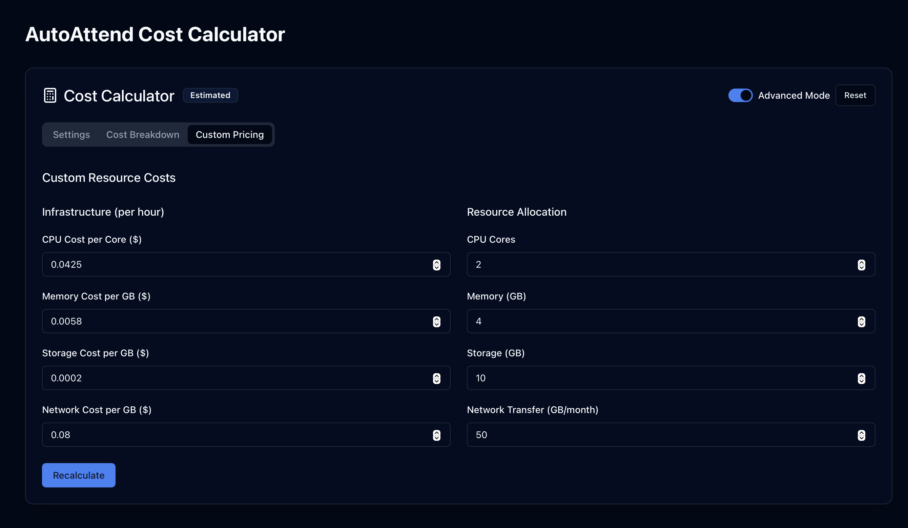

# AutoAttend Cost Calculator

This document provides a comprehensive overview of the AutoAttend Cost Calculator, a tool designed to help educational institutions estimate the financial implications of deploying the facial recognition attendance system. The calculator offers a transparent view of potential costs based on configuration choices.

## Calculator Overview

The AutoAttend Cost Calculator provides estimated costs across four main categories:

1. **Infrastructure Costs** - Physical computing resources required for operation
2. **Model Selection** - Impact of AI model choices on performance and cost
3. **Processing Settings** - Runtime configuration that affects resource utilization
4. **Deployment Scale** - Scope and scale of the implementation

## Calculator Interface

The calculator interface is organized into tabbed sections for intuitive navigation:

*The cost calculator provides a comprehensive interface for estimating deployment costs based on various parameters.*

## Model Selection

The model selection significantly impacts both system performance and overall costs. The calculator allows you to choose between different face detection and recognition models to balance accuracy and resource requirements.

:::zoomable-mermaid

:::
 

## Performance Settings

Performance settings directly impact resource utilization and consequently affect the overall cost of deployment.

### Max Frame Size

The maximum frame size determines the resolution of video frames processed for face detection. This can be obtained from the camera specs.

- **Range**: 320-1920 pixels
- **Lower values** (e.g., 320-480px): Lower cost, reduced accuracy
- **Higher values** (e.g., 1280-1920px): Higher cost, improved accuracy
- **Cost Impact**: Higher resolutions increase processing and network costs significantly

### Max FPS (Frames Per Second)

The maximum number of frames processed per second.

- **Range**: 1-30 FPS
- **Lower values** (e.g., 1-5 FPS): Lower cost, suitable for static environments
- **Higher values** (e.g., 15-30 FPS): Higher cost, better for dynamic environments
- **Cost Impact**: Each additional frame increases computational resource requirements linearly

### Face Tracking

Face tracking allows the system to follow faces across frames without full detection on every frame.

- **Enabled**: Slightly higher cost but improves efficiency for continuous monitoring
- **Disabled**: Lower immediate cost but may require more frequent full-frame detections
- **Cost Impact**: Modest increase in computational needs, generally cost-effective for continuous operation

## Deployment Settings

Deployment settings define the scale and scope of your AutoAttend implementation.

### Number of Concurrent Streams

The number of camera feeds processed simultaneously.

- **Range**: 1-10 streams
- **Cost Impact**: Linear scaling of processing and resource requirements per stream

### Number of Instances

The number of processing instances deployed (for load balancing or redundancy).

- **Range**: 1-5 instances
- **Cost Impact**: Linear scaling of infrastructure costs per instance

## Usage Pattern

The usage pattern defines when and how often the system will be operational.

### Operational Hours

The total time the system will be active, measured in hours per day and days per month.

- **Hours Range**: 1-24 hours per day
- **Days Range**: 1-31 days per month
- **Optimization Tip**: Configuring precise operational hours to match actual class schedules can significantly reduce costs

## Cost Breakdown

The calculator provides a comprehensive cost breakdown across multiple time horizons.

:::zoomable-mermaid

:::
 

### Cost Summary Cards

The calculator provides at-a-glance cost summaries across different time periods:

*Quick reference cost cards showing hourly, daily, monthly, and per-stream costs.*

## Advanced Mode

For institutions with specific pricing information or custom infrastructure requirements, the calculator offers an advanced mode.

*Advanced mode allows customization of all cost parameters for more precise estimates.*

### Customizable Parameters

- Infrastructure costs (CPU, memory, storage, network)
- Resource allocation specifics
- Custom pricing based on specific cloud providers or on-premises deployments

## Implementation Considerations

### Cost Optimization Strategies

The calculator can help identify optimal configurations based on your institution's specific needs:

1. **Scale-Optimized**: Maximize number of streams with minimal resource allocation
2. **Performance-Optimized**: Prioritize accuracy and responsiveness over cost
3. **Balanced**: Find the optimal middle ground between cost and performance

### Deployment Scenarios

| Scenario | Typical Configuration | Estimated Monthly Cost Range |
|----------|------------------------|--------------------------|
| Small Institution (1-5 cameras) | YOLOv8n, R50, 640px, 10 FPS | $XXX - $XXX |
| Medium Institution (5-20 cameras) | YOLO11n, R50, 640px, 10 FPS | $XXX - $XXX |
| Large Institution (20+ cameras) | YOLOv11s, R100, 1280px, 15 FPS | $XXX - $XXX |

!!! Note
    The cost estimates provided by the calculator are approximations based on typical cloud infrastructure pricing. 
    Actual costs may vary based on your specific provider, region, and negotiated rates. 
!!!
 

## Best Practices

### Getting Accurate Estimates

To get the most accurate cost estimates:

1. Configure the calculator to match your specific deployment scenario
2. Consider both peak and average usage patterns
3. Adjust settings to find the optimal balance between cost and performance
4. Use advanced mode if you have specific pricing information

### Cost-Effective Configuration

For most educational institutions, we recommend:

- Start with a balanced configuration
- Monitor actual usage patterns after initial deployment
- Adjust parameters based on real-world performance and costs
- Consider scaling up during peak periods (beginning/end of semesters)

## Related Documentation

For comprehensive information about the complete AutoAttend system, please refer to:

- [AutoAttend Architecture](kubernetes.md) - System architecture and deployment
- [Registration System](regis.md) - Student enrollment and face embedding capture
- [Face Recognition Settings](face-recognition-settings.md) - Detailed face recognition configuration
