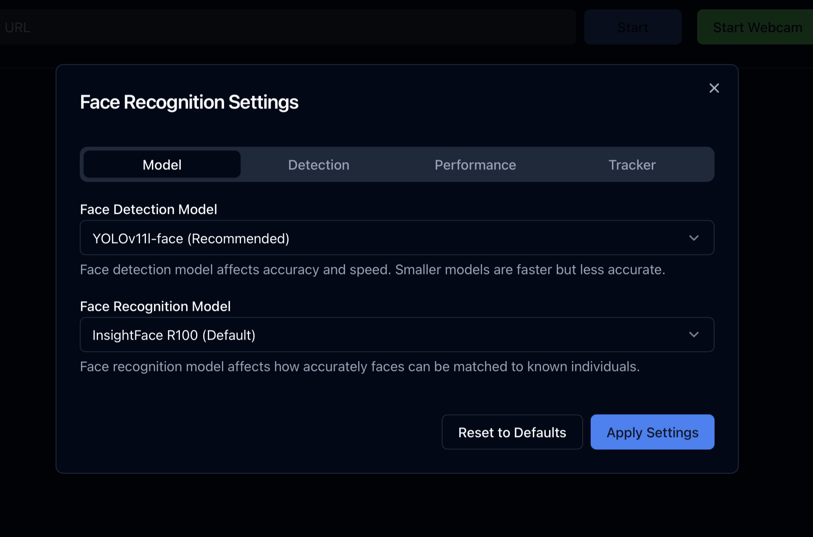
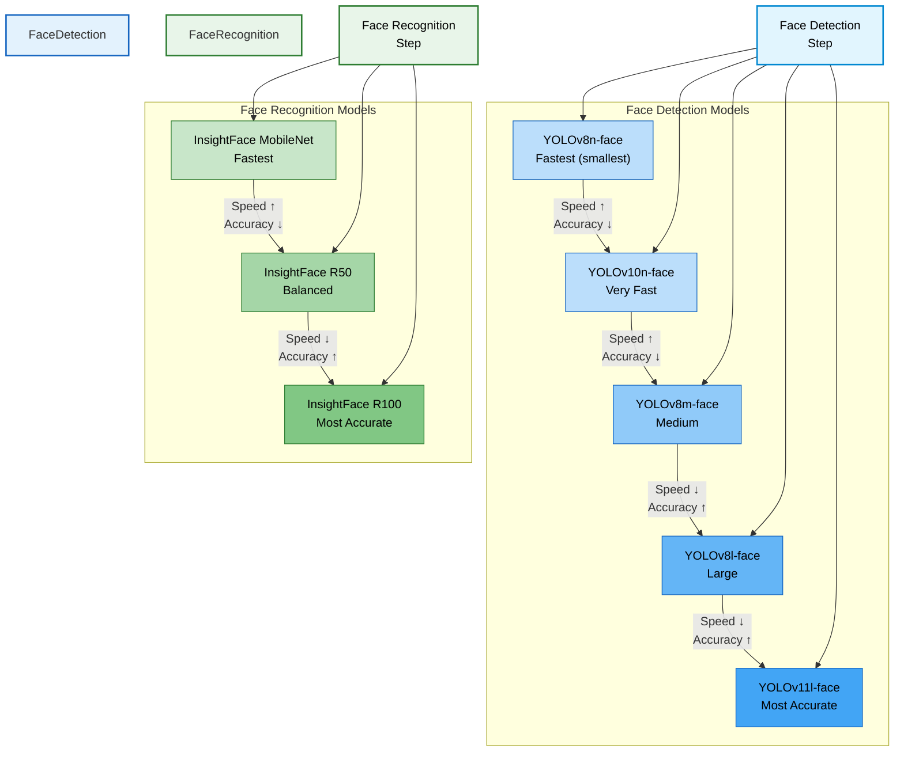
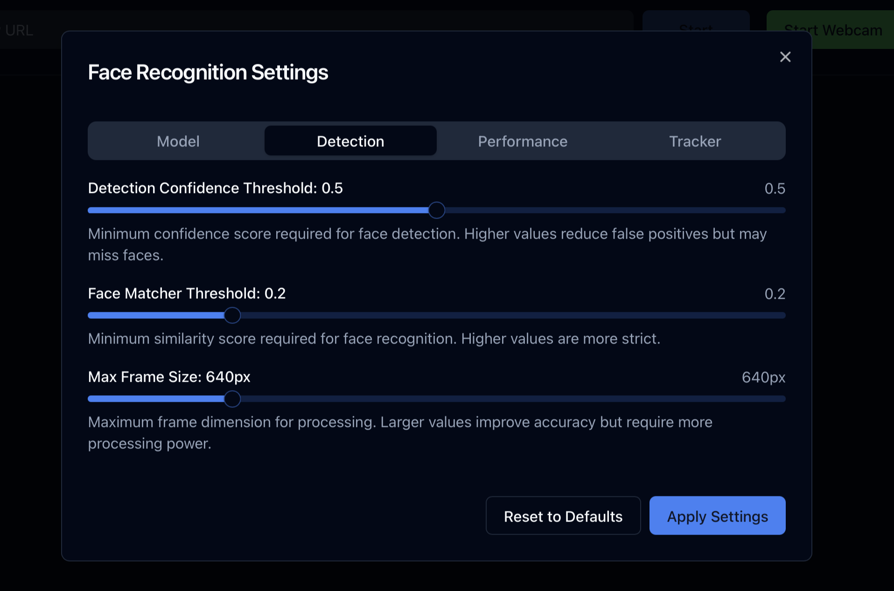
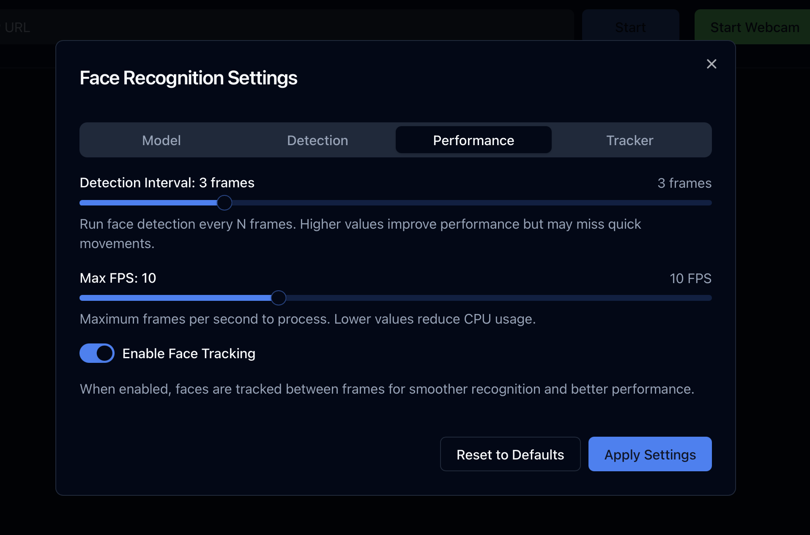
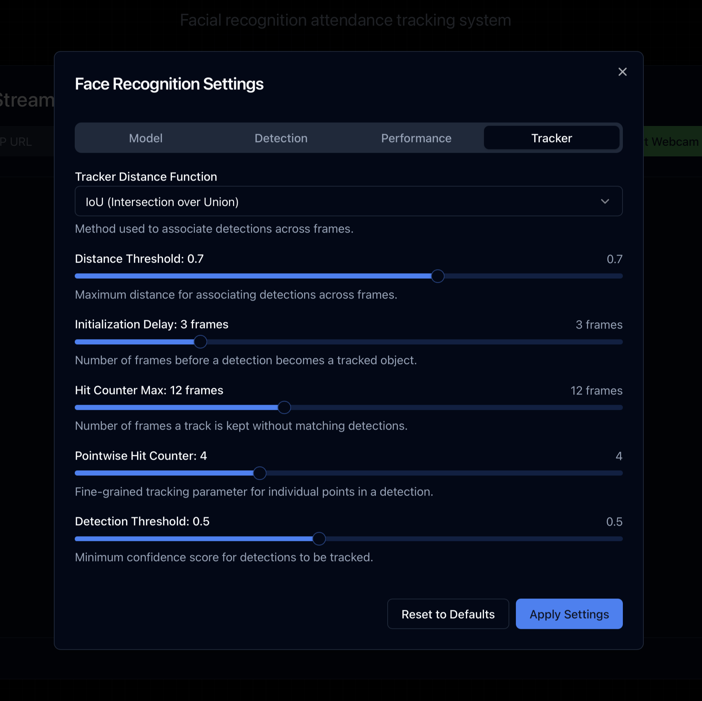
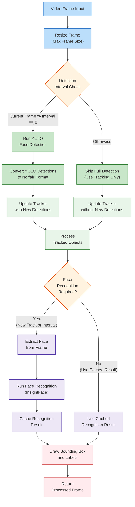

# Face Recognition Settings

This document provides an in-depth overview of the customizable face recognition configuration options available in the AutoAttend system. These settings enable precise control over detection accuracy, recognition performance, and resource utilization to balance system requirements.

## Settings Overview

The face recognition system provides extensive configuration options across four main categories:

1. **Model Selection** - Choose between different detection and recognition models
2. **Detection Parameters** - Fine-tune confidence thresholds and frame processing
3. **Performance Optimization** - Balance processing speed and resource utilization
4. **Tracking Configuration** - Configure advanced tracking parameters for smooth recognition

## Configuration Interface

The configuration interface is organized into tabbed sections for easy navigation:


*The settings dialog provides a comprehensive interface for configuring all face recognition parameters.*

## Model Settings

AutoAttend supports multiple face detection and recognition models to accommodate various performance and accuracy requirements.

:::zoomable-mermaid

:::

### Detection Models

| Model | File Size | Speed | Accuracy | Use Case |
|-------|-----------|-------|----------|----------|
| YOLOv8n-face | 6.5 MB | Fastest | Lower | Mobile, edge devices |
| YOLOv10n-face | 7.8 MB | Very Fast | Moderate | Resource-constrained systems |
| YOLOv8m-face | 25.5 MB | Balanced | Good | General-purpose |
| YOLOv8l-face | 46.2 MB | Slower | High | High accuracy requirements |
| YOLOv11l-face | 89.7 MB | Slowest | Highest | Research, critical applications |

### Recognition Models

| Model | File Size | Speed | Accuracy | Use Case |
|-------|-----------|-------|----------|----------|
| InsightFace MobileNet | 11.4 MB | Fastest | Lower | Edge devices, high throughput |
| InsightFace R50 | 96.8 MB | Balanced | Good | General-purpose |
| InsightFace R100 | 248.5 MB | Slowest | Highest | High security, critical applications |

## Detection Settings

The detection settings control the core behavior of the face detection and recognition pipeline.


*Configure detection parameters to balance false positives and false negatives.*

### Confidence Threshold

The confidence threshold (range: 0.0-1.0) determines how certain the model must be before considering a detection valid.

- **Higher values** (e.g., 0.7-0.9): Fewer false positives, but may miss some faces
- **Lower values** (e.g., 0.3-0.5): Detects more faces, but may include false positives
- **Recommended**: 0.5 for general use

### Face Matcher Threshold

The face matcher threshold (range: 0.0-1.0) controls how similar a detected face must be to a known face for recognition.

- **Higher values** (e.g., 0.7-0.9): More strict matching, lower false acceptance rate
- **Lower values** (e.g., 0.1-0.3): More lenient matching, higher false acceptance rate
- **Recommended**: 0.2 for balanced performance

### Max Frame Size

Maximum frame dimension in pixels for processing. Larger values provide higher detection accuracy but require more processing power.

- **Range**: 320-1920 pixels
- **Recommended**: 
  - 640px for real-time processing on standard hardware
  - 1280px for higher accuracy where processing power allows

## Performance Settings

Performance settings allow you to balance processing speed, resource utilization, and detection quality.


*Optimize performance settings based on your hardware capabilities and requirements.*

### Detection Interval

The detection interval determines how often (in frames) full face detection is performed.

- **Range**: 1-10 frames
- **Lower values** (e.g., 1-2): More responsive detection, higher CPU usage
- **Higher values** (e.g., 5-10): More efficient processing, may miss quick movements
- **Recommended**: 3 for general use

### Max FPS

Maximum frames per second to process. Lower values reduce CPU usage.

- **Range**: 1-30 FPS
- **Lower values** (e.g., 5-10): Reduced CPU load, suitable for background processing
- **Higher values** (e.g., 15-30): Smoother experience, better for interactive scenarios
- **Recommended**: 10 for balanced performance

### Face Tracking

When enabled, faces are tracked between frames for smoother recognition and better performance. This setting enables Norfair tracking features.

- **Enabled**: Better performance with smooth tracking between frames
- **Disabled**: Process each frame independently (higher CPU usage)
- **Recommended**: Enabled for most use cases

## Tracker Settings

Advanced settings for fine-tuning the Norfair object tracking system.


*Configure tracking parameters for optimal continuity in face tracking.*

### Distance Function

Method used to associate detections across frames:

- **IoU (Intersection over Union)**: Best for most face tracking scenarios
- **Euclidean Distance**: Alternative for special cases where IoU doesn't perform well
- **Manhattan Distance**: May perform better in certain grid-aligned scenarios
- **Recommended**: IoU for face tracking

### Distance Threshold

Maximum distance for associating detections across frames (range: 0.1-1.0).

- **Higher values**: More lenient association, may confuse different faces
- **Lower values**: Stricter association, may fragment tracks of the same face
- **Recommended**: 0.7 for face tracking

### Initialization Delay

Number of frames before a detection becomes a tracked object (range: 1-10).

- **Higher values**: More stable tracks, less flickering, but slower to initialize
- **Lower values**: Faster tracking initialization, may include some false tracks
- **Recommended**: 3 frames

### Hit Counter Max

Number of frames a track is kept without matching detections (range: 1-30).

- **Higher values**: Tracks persist longer through occlusions
- **Lower values**: Tracks are removed more quickly when faces disappear
- **Recommended**: 12 frames

### Pointwise Hit Counter Max

Fine-grained tracking parameter for individual points in a detection (range: 1-10).

- **Higher values**: More stable tracking of individual facial points
- **Lower values**: Quicker updates to facial point positions
- **Recommended**: 4 for face tracking

### Detection Threshold

Minimum confidence score for detections to be tracked (range: 0.1-1.0).

- **Higher values**: Only high confidence detections are tracked
- **Lower values**: Track lower confidence detections as well
- **Recommended**: 0.5 for balanced performance

## Performance Impact

The following table illustrates the approximate impact of different configuration combinations on system performance:

| Configuration | CPU Usage | RAM Usage | Detection Accuracy | Recognition Accuracy | FPS |
|---------------|-----------|-----------|-------------------|---------------------|-----|
| Highest Performance | Low | Low | Lower | Lower | 25-30 |
| Balanced | Medium | Medium | Good | Good | 10-15 |
| Highest Accuracy | High | High | Excellent | Excellent | 5-8 |

**Highest Performance Configuration:**
- Face Detection: YOLOv8n-face
- Face Recognition: InsightFace MobileNet
- Max Frame Size: 480px
- Detection Interval: 6
- Face Tracking: Enabled

**Balanced Configuration:**
- Face Detection: YOLOv8m-face
- Face Recognition: InsightFace R50
- Max Frame Size: 640px
- Detection Interval: 3
- Face Tracking: Enabled

**Highest Accuracy Configuration:**
- Face Detection: YOLOv11l-face
- Face Recognition: InsightFace R100
- Max Frame Size: 1280px
- Detection Interval: 1
- Face Tracking: Enabled

## Technical Implementation

### Face Detection Process

The AutoAttend system uses a multi-stage processing pipeline for face detection and recognition:

:::zoomable-mermaid

:::

### Settings Integration

The configurable settings directly impact each stage of the processing pipeline:

1. **Model settings** determine which neural network models are loaded for detection and recognition
2. **Detection settings** control confidence thresholds and input frame sizing
3. **Performance settings** manage processing intervals and throughput
4. **Tracker settings** fine-tune how faces are tracked between frames

## Best Practices

### General Recommendations

- Start with the balanced configuration and adjust based on your specific requirements
- Monitor CPU and memory usage when changing settings
- For high-traffic areas, prioritize performance settings
- For security applications, prioritize accuracy settings

### Environment-Specific Recommendations

| Environment | Recommended Configuration |
|-------------|---------------------------|
| Classroom | Balanced, 10-15 FPS |
| Office Entry | Higher Accuracy, 5-10 FPS |
| Stadium/Large Venue | Higher Performance, 15-30 FPS |
| Security Checkpoint | Highest Accuracy, 5-8 FPS |


## Troubleshooting

### Common Issues

| Issue | Potential Causes | Solutions |
|-------|------------------|-----------|
| High CPU usage | Low detection interval, high FPS | Increase detection interval, reduce max FPS |
| Missed detections | Confidence threshold too high, frame size too small | Lower confidence threshold, increase frame size |
| False recognitions | Matcher threshold too low | Increase matcher threshold |
| Jerky tracking | Tracker distance threshold too low | Increase tracker distance threshold |
| Slow performance | Frame size too large, model too complex | Reduce frame size, use a smaller model |

### Performance Monitoring

Monitor the system performance metrics to identify bottlenecks:

```bash
# CPU usage per process
top -o %CPU

# Memory usage
free -m

# FPS metrics (from application logs)
kubectl logs -n backend -l app=backend | grep "FPS"
```

## Related Documentation

For comprehensive information about the complete AutoAttend system, please refer to:

- [AutoAttend Architecture](kubernetes.md) - System architecture and deployment
- [Registration System](regis.md) - Student enrollment and face embedding capture
