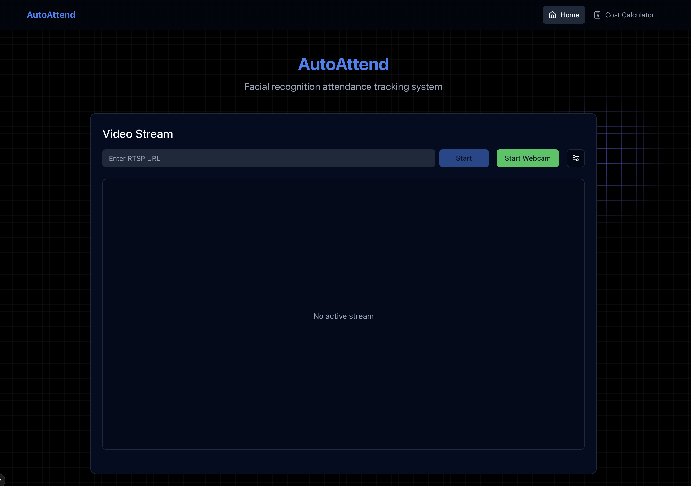
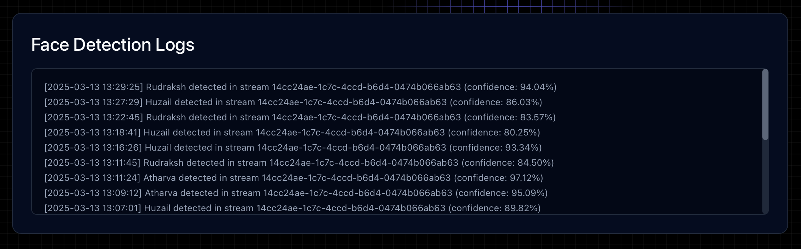
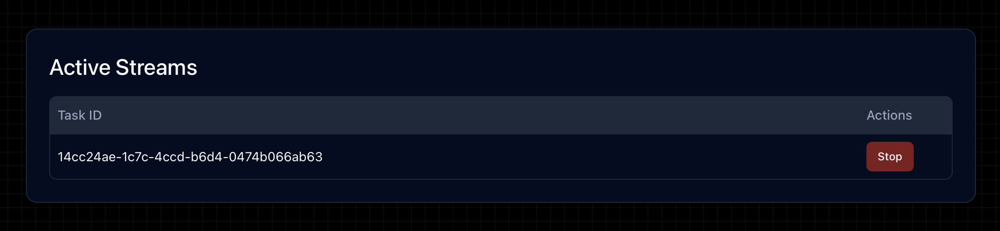
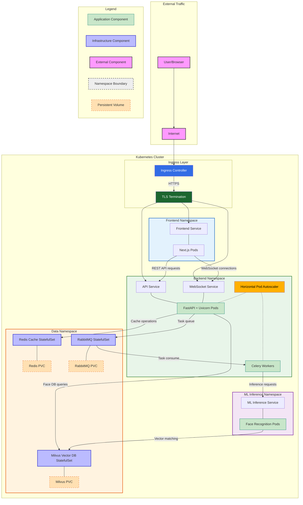
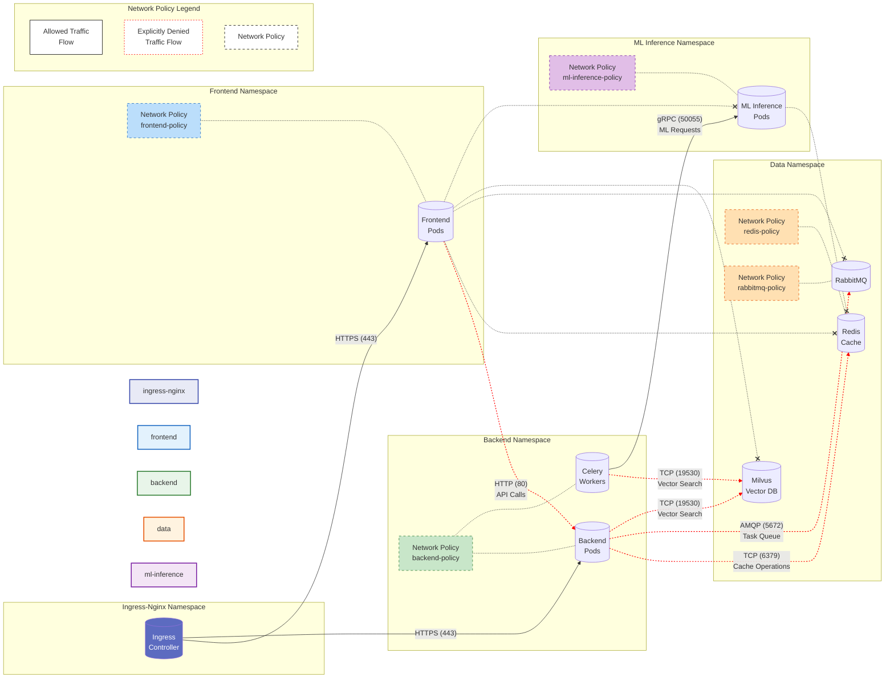
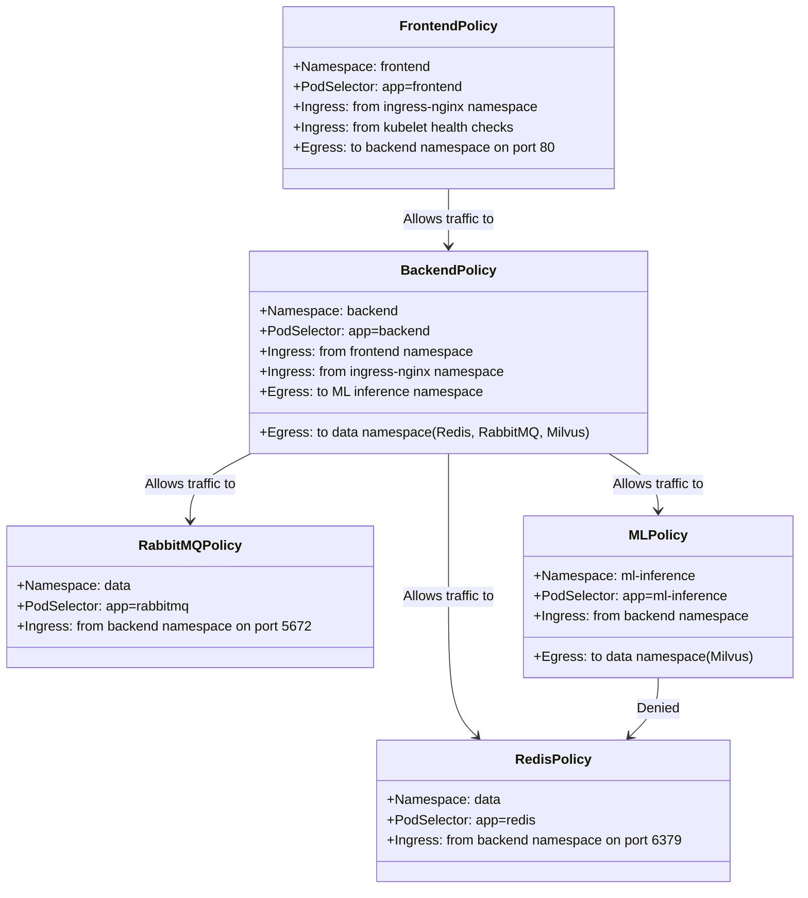
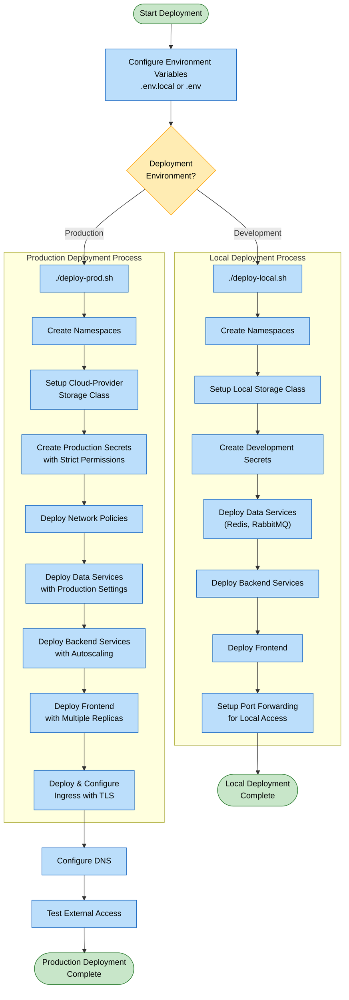
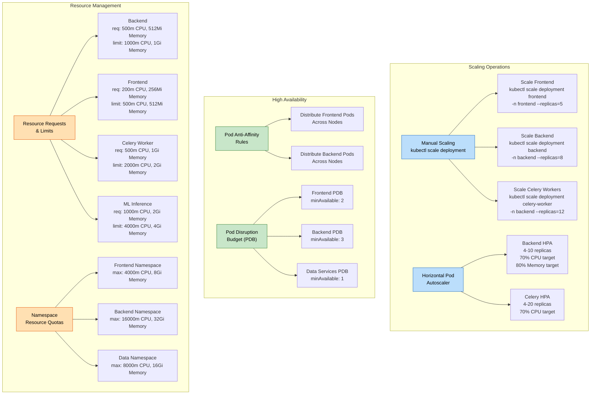
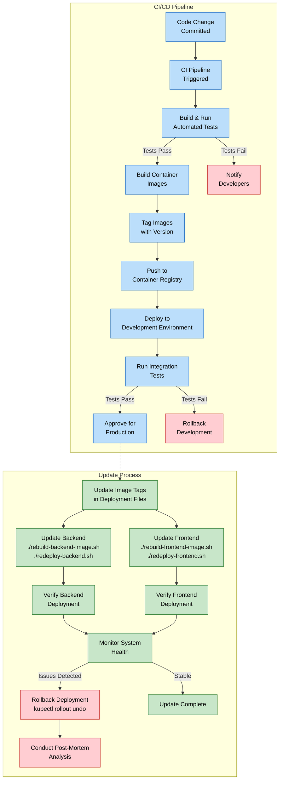

```mermaid
flowchart TB
    subgraph "Monitoring Components"
        Prometheus["Prometheus<br>Metrics Collection"]
        Grafana["Grafana<br>Dashboards"]
        AlertManager["Alert Manager<br>Notifications"]
        Loki["Loki<br>Log Aggregation"]
        
        Prometheus --> Grafana
        Prometheus --> AlertManager
        Loki --> Grafana
    end
    
    subgraph "System Metrics"
        NodeMetrics["Node Metrics<br>CPU, Memory, Disk, Network"]
        PodMetrics["Pod Metrics<br>CPU, Memory, Restarts"]
        AppMetrics["Application Metrics<br>Request Rate, Latency, Errors"]
        DBMetrics["Database Metrics<br>Connections, Query Performance"]
        
        NodeExporter["Node Exporter"] --> NodeMetrics
        cAdvisor["cAdvisor"] --> PodMetrics
        ServiceMonitor["Service Monitor"] --> AppMetrics
        DBExporter["Database Exporter"] --> DBMetrics
        
        NodeMetrics --> Prometheus
        PodMetrics --> Prometheus
        AppMetrics --> Prometheus
        DBMetrics --> Prometheus
    end
    
    subgraph "Log Collection"
        AppLogs["Application Logs"]
        K8sLogs["Kubernetes Events"]
        IngressLogs["Ingress Controller Logs"]
        
        Fluentbit["Fluent Bit"] --> AppLogs
        Fluentbit --> K8sLogs
        Fluentbit --> IngressLogs
        
        AppLogs --> Loki
        K8sLogs --> Loki
        IngressLogs --> Loki
    end
    
    subgraph "Health Checks"
        LivenessProbes["Liveness Probes<br>Is the container running?"]
        ReadinessProbes["Readiness Probes<br>Is the service ready to accept traffic?"]
        StartupProbes["Startup Probes<br>Has the application started?"]
        
        LivenessProbes --> KubeAPI["Kubernetes API"]
        ReadinessProbes --> KubeAPI
        StartupProbes --> KubeAPI
    end
    
    subgraph "Alerting"
        HighCPU["High CPU Usage"]
        HighMemory["High Memory Usage"]
        PodCrash["Pod Crash"]
        HighLatency["High API Latency"]
        ErrorRate["High Error Rate"]
        
        HighCPU --> AlertManager
        HighMemory --> AlertManager
        PodCrash --> AlertManager
        HighLatency --> AlertManager
        ErrorRate --> AlertManager
        
        AlertManager --> Email["Email"]
        AlertManager --> Slack["Slack"]
        AlertManager --> PagerDuty["PagerDuty"]
    end
    
    style Prometheus fill:#bbdefb,stroke:#1565c0,color:black;
    style Grafana fill:#bbdefb,stroke:#1565c0,color:black;
    style AlertManager fill:#bbdefb,stroke:#1565c0,color:black;
    style Loki fill:#bbdefb,stroke:#1565c0,color:black;
    
    style NodeMetrics,PodMetrics,AppMetrics,DBMetrics fill:#c8e6c9,stroke:#2e7d32,color:black
    style NodeExporter,cAdvisor,ServiceMonitor,DBExporter fill:#e3f2fd,stroke:#1565c0,color:black
    style AppLogs,K8sLogs,IngressLogs fill:#e8f5e9,stroke:#2e7d32,color:black
    style LivenessProbes,ReadinessProbes,StartupProbes fill:#fff3e0,stroke:#e65100,color:black
    style HighCPU,HighMemory,PodCrash,HighLatency,ErrorRate fill:#ffcdd2,stroke:#c62828,color:black
    style Email,Slack,PagerDuty fill:#f3e5f5,stroke:#7b1fa2,color:black
```

# AutoAttend Architecture

This repository provides production-ready Kubernetes configurations for deploying AutoAttend, a scalable facial recognition attendance tracking system. AutoAttend uses Milvus vector database for efficient face matching and supports real-time attendance monitoring via web interface.






*The system shows logs of detected features, allows downloading them and more for each stream. The system also allows turning on/off streams.*

!!! Note
    For installation, we send you the images for frontend and backend and template environment files. 
    We also send you a template kubernetes configuration that you can tweak according to your needs. 
    If you want to start small, we also send you a production grade docker compose file.
!!!
<br>

## System Architecture

AutoAttend is architected as a cloud-native application following microservices patterns and best practices for Kubernetes deployments.

:::zoomable-mermaid

:::

## Key Components

### Namespaces

The system uses Kubernetes namespaces to isolate components:

| Namespace | Description |
|-----------|-------------|
| `frontend` | User interface components |
| `backend` | API services and application logic |
| `data` | Databases and message brokers |
| `ml-inference` | ML processing services |


### Component Breakdown

| Component | Technology | Purpose |
|-----------|------------|---------|
| Frontend | Next.js | User interface for attendance tracking |
| Backend API | FastAPI | RESTful API endpoints for system interaction |
| WebSocket | FastAPI/WebSockets | Real-time communication channel |
| Celery Workers | Celery | Asynchronous task processing |
| Redis | Redis | Caching and Celery result backend |
| RabbitMQ | RabbitMQ | Message brokering for task queue |
| ML Inference | Custom | Face detection and recognition processing |
| Milvus | Milvus Vector DB | Storage and querying of face embeddings |


## Prerequisites

Before deploying, ensure you have:

- Kubernetes cluster (1.18+)
- kubectl CLI tool configured to connect to your cluster
- Docker and container registry access
- Domain name (for production deployment)
- TLS certificates (for production deployment)


## Configuration

### Environment Variables

The system is configured using environment variables. Copy the `.env.example` file to `.env` for production deployment:

```bash
# OR
cp .env.example .env  # For production deployment
```

Key configuration parameters:

| Variable | Description | Example |
|----------|-------------|---------|
| `DOMAIN` | Primary domain name | `attendance.example.com` |
| `API_DOMAIN` | API subdomain | `api.attendance.example.com` |
| `WS_DOMAIN` | WebSocket subdomain | `ws.attendance.example.com` |
| `REDIS_PASSWORD` | Redis password | `strong-random-password` |
| `RABBITMQ_USER` | RabbitMQ username | `user` |
| `RABBITMQ_PASSWORD` | RabbitMQ password | `strong-random-password` |
| `DOCKER_USERNAME` | Docker registry username | `username` |
| `DOCKER_PASSWORD` | Docker registry password | `password` |

## Deployment

### Production Deployment

For production environments:

```bash
./deploy-prod.sh
```

This script:
1. Creates production-grade configurations
2. Sets up TLS/SSL with cert-manager
3. Configures ingress rules
4. Applies resource limits and auto-scaling
5. Sets up network policies for security

## Security Features

The deployment implements several security best practices:

- Namespace isolation with network policies
- Non-root container execution
- Resource quotas and limits
- TLS/SSL encryption for all traffic
- Secret management for sensitive information
- RBAC for service accounts
- Network policies restricting pod-to-pod communication

## Network Policies

Network policies enforce strict rules for pod-to-pod communication, implementing the principle of least privilege to minimize the attack surface.

:::zoomable-mermaid

:::
<br>


### Detailed Network Policy Configuration

Each namespace has one or more network policies that restrict pod-to-pod communication:

:::zoomable-mermaid

:::
<br>


## Deployment Process

The deployment process follows a structured approach to ensure consistency and reliability in both development and production environments.

:::zoomable-mermaid

:::
<br>

## Maintenance Operations

### Scaling and Reliability

The system implements both manual scaling and Horizontal Pod Autoscaling (HPA) for dynamic resource adjustment based on workload.

:::zoomable-mermaid

:::
<br>

### CI/CD and Update Process

The system implements a robust CI/CD pipeline and structured update process to ensure reliable deployments.

:::zoomable-mermaid

:::
<br>

### Monitoring and Observability

The system implements comprehensive monitoring and observability for real-time system health tracking.

:::zoomable-mermaid

:::
<br>


### Health Checks and Monitoring Commands

```bash
# Check pod status
kubectl get pods --all-namespaces

# View logs
kubectl logs -f -n backend -l app=backend
kubectl logs -f -n frontend -l app=frontend

# Monitor resource usage
kubectl top pods --all-namespaces
```

## Face Recognition System

The system uses advanced facial recognition algorithms to track attendance:

1. **Face Detection**: Detects and isolates faces in camera feeds
2. **Face Embedding**: Converts facial features into vector representations
3. **Vector Matching**: Compares embeddings against stored profiles in Milvus
4. **Attendance Recording**: Records matches with timestamps in the database

### Milvus Configuration

The Milvus vector database is configured for efficient face embedding storage and retrieval:

```yaml
# Example Milvus collection configuration
collection_name: face_embeddings
dimension: 512
index_type: IVF_FLAT
metric_type: L2
```

## Troubleshooting

### Common Issues

| Issue | Solution |
|-------|----------|
| Pods in CrashLoopBackOff | Check logs: `kubectl logs -n <namespace> <pod-name>` |
| Database connection errors | Verify secrets and check data service health |
| Image pull errors | Check Docker registry credentials |
| Ingress not working | Verify ingress controller and DNS configuration |

### Debugging Commands

```bash
# Check events
kubectl get events -n <namespace>

# Describe resource
kubectl describe pod <pod-name> -n <namespace>

# Port forward for direct access
kubectl port-forward -n <namespace> svc/<service> <local-port>:<service-port>

# Check logs with timestamps
kubectl logs -f -n <namespace> <pod-name> --timestamps
```

## Best Practices

- **Resource Management**: Set appropriate requests and limits for all containers
- **Liveness/Readiness Probes**: Implement for all services for better auto-healing
- **StatefulSets**: Use for stateful services like databases
- **ConfigMaps/Secrets**: Separate configuration from code
- **Rolling Updates**: Use for zero-downtime deployments
- **Namespace Isolation**: Keep components separated for better security

## Additional Resources

- [Kubernetes Documentation](https://kubernetes.io/docs/)
- [Milvus Documentation](https://milvus.io/docs)
- [FastAPI Documentation](https://fastapi.tiangolo.com/)
- [Next.js Documentation](https://nextjs.org/docs)
