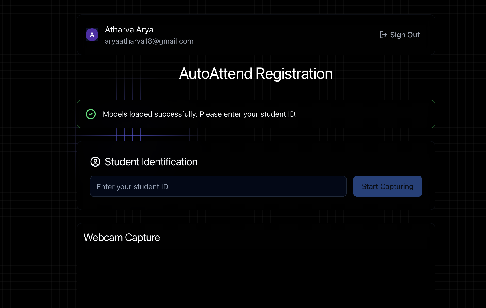
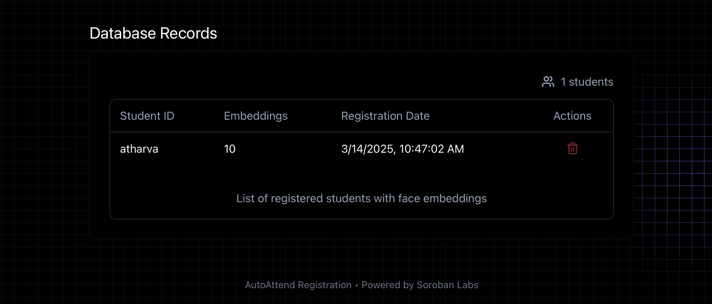
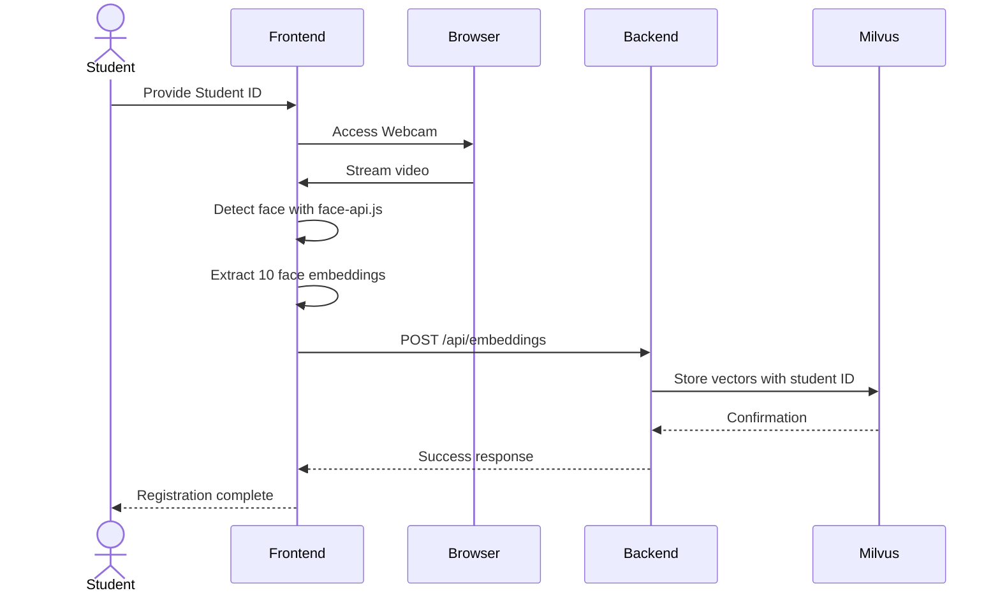

# AutoAttend Registration System

## Overview

The Registration System is a core component of the AutoAttend facial recognition ecosystem, specifically focused on the student enrollment and face embedding capture process. This document details the registration workflow, API endpoints, and technical implementation of the registration features.


*The utility offers Google based sign in and quick embedding storage and integrates with the kubernetes architecture.*


*Once the student is done, the admin is able to see all existing records.*

## Registration Workflow



## API Documentation

### Embeddings API

| Endpoint | Method | Description |
|----------|--------|-------------|
| `/api/embeddings` | POST | Store face embeddings |
| `/api/embeddings/{student_id}` | GET | Retrieve embeddings for a student |
| `/api/embeddings/{student_id}` | DELETE | Remove a student's embeddings |
| `/api/search` | POST | Find matching faces |
| `/api/students` | GET | List all registered students |

### Example: Storing Embeddings

```json
// POST /api/embeddings
{
  "student_id": "S12345",
  "embeddings": [
    [0.1, 0.2, 0.3, ...], // 128-dimensional vector
    [0.2, 0.3, 0.4, ...],
    // 8 more embeddings...
  ],
  "timestamp": 1678432516789
}
```

### Example: Searching for a Match

```json
// POST /api/search
{
  "embedding": [0.1, 0.2, 0.3, ...],
  "limit": 5,
  "threshold": 0.7
}
```

## Technical Details

### Face Embeddings

The registration system generates 128-dimensional face embeddings using face-api.js, which is powered by TensorFlow.js. These embeddings capture the unique facial features of individuals and allow for efficient similarity searches.

### Milvus Configuration

The registration system uses a specialized HNSW (Hierarchical Navigable Small World) index for fast approximate nearest neighbor search, which is ideal for face recognition:

```python
index_params = {
    "metric_type": "L2",  # Euclidean distance
    "index_type": "HNSW",
    "params": {"M": 16, "efConstruction": 200}
}
```

### Database Schema

The face embeddings collection has the following structure:

| Field | Type | Description |
|-------|------|-------------|
| id | INT64 | Primary key (auto-generated) |
| student_id | VARCHAR | Unique identifier for the student |
| embedding | FLOAT_VECTOR[128] | Face embedding vector |
| timestamp | INT64 | Unix timestamp of registration |

## Troubleshooting

### Common Registration Issues

- **Models not loading**: Ensure models are downloaded to the `public/models` directory
- **Webcam not working**: Check browser permissions and ensure your device has a working camera
- **Face detection issues**: Improve lighting and position face clearly in the frame
- **Registration failures**: Verify that the student ID is unique and properly formatted

## Related Documentation

For comprehensive information about the AutoAttend system architecture, deployment, and Kubernetes configuration, please refer to the [AutoAttend Architecture](kubernetes.md) documentation.
